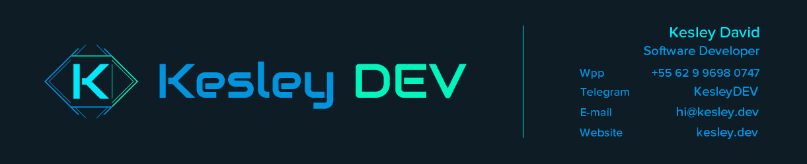

  

# Hi, I'm Kesley 👋

**Senior Full-Stack Engineer | TypeScript, React, Node.js & AWS | AI Integrations**

I'm the founder of **Kesley DEV**. I build web applications, APIs, SaaS products and data workflows, working across architecture, frontend, backend, cloud infrastructure and delivery.

My background includes **17 years of hands-on JavaScript experience**, **8 years with React and Node.js**, **5 years with TypeScript**, and **6 years with AWS**.

## What I work on

- **Full-stack development:** web applications, APIs, dashboards and business systems.
- **Cloud infrastructure:** AWS services, serverless architectures and integrations between services.
- **Applied AI:** LLM API integrations, prompt engineering, model orchestration, structured responses and output validation.
- **Data processing:** ingestion, cleaning, validation, enrichment, deduplication and batch processing.
- **Software delivery:** containerized environments, automated checks and CI/CD pipelines.

I also experiment with **RAG, local LLMs and LoRA fine-tuning** through prototypes and small projects.

## Main stack

| Area | Technologies |
|---|---|
| Languages | JavaScript, TypeScript, Python |
| Frontend | React, Next.js, HTML, CSS, Tailwind CSS |
| Mobile | React Native, Expo |
| Backend | Node.js, Express, NestJS, REST APIs |
| Cloud | AWS, serverless architectures |
| Data | PostgreSQL, DynamoDB, MongoDB, pandas, DuckDB |
| Delivery | Docker, Git, GitHub Actions, GitLab CI/CD |

## Credentials and training

- GitLab Certified Git Associate
- GitLab Certified Associate
- Oracle Cloud Foundations
- Uncomplicating Docker — LinuxTips

## A little about me

I enjoy technology, gaming and learning through practical projects.

I value clear communication, maintainable code and solutions that address real business needs. I'm open to collaborating on React, Next.js, Node.js and applied AI projects.

## Get in touch

[Website](https://www.kesley.dev/) ·
[LinkedIn](https://www.linkedin.com/in/kesleydavid/) ·
[Email](mailto:hi@kesley.dev)
